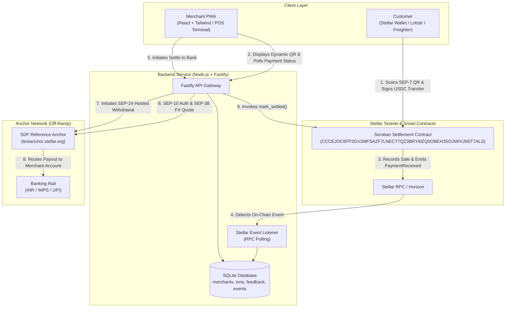

# StellarPe — QR Merchant Settlement Layer on Stellar

> Accept digital dollars. Get rupees. No crypto knowledge required.

[](https://stellar.org)
[](https://soroban.stellar.org)
[]()
[](.github/workflows/ci.yml)
[](LICENSE)

---

## Quick Links and Live Demo

| Resource | Link / Details |
|---|---|
| **Demo Video (1080p Full HD)** | [Watch on Google Drive](https://drive.google.com/file/d/1FCza66_cD_GCA5Qh4LM7fXrUCSDRdTlC/view?usp=sharing) · [`docs/stellarpe_demo_60s.mp4`](./docs/stellarpe_demo_60s.mp4) · [WebM](./docs/stellarpe_demo_60s.webm) |
| **Deployed Smart Contract** | [`CCCEJOC6FP2GV2MFSAZF7LNECT7QZ3BRYMZQ5OBEH3SOJWIVJN5T7ALS`](https://stellar.expert/explorer/testnet/contract/CCCEJOC6FP2GV2MFSAZF7LNECT7QZ3BRYMZQ5OBEH3SOJWIVJN5T7ALS) (Stellar Testnet) |
| **Contract Initialization Tx** | [`0efdab22bef08ac3bad9c586ed96e7a5a1969800f601e15961299536e18eee6f`](https://stellar.expert/explorer/testnet/tx/0efdab22bef08ac3bad9c586ed96e7a5a1969800f601e15961299536e18eee6f) |
| **On-Chain User Proofs** | 10+ Verified Testnet Payments in [`users.csv`](./users.csv) and [`docs/user_proofs.json`](./docs/user_proofs.json) |
| **Live Web Application** | `[TODO: Paste deployed frontend URL, e.g. https://stellarpe.vercel.app]` |

---

## Table of Contents
- [Overview](#overview)
- [Problem Statement](#problem-statement)
- [Why Stellar](#why-stellar)
- [Target Users](#target-users)
- [Architecture and Data Flow](#architecture-and-data-flow)
- [Smart Contract (Soroban)](#smart-contract-soroban)
- [User Onboarding and Testnet Proof of Usage](#user-onboarding-and-testnet-proof-of-usage)
- [Feedback Collection](#feedback-collection)
- [Screenshots and UI Showcase](#screenshots-and-ui-showcase)
- [CI/CD Pipeline](#cicd-pipeline)
- [Analytics and Monitoring](#analytics-and-monitoring)
- [Tech Stack](#tech-stack)
- [Project Structure](#project-structure)
- [Getting Started](#getting-started)
- [Roadmap](#roadmap)
- [License](#license)

---

## Overview

**StellarPe** is a QR-based point-of-sale settlement layer that lets small merchants (campus canteens, hostel stalls, local shops) accept stablecoin (USDC) payments from customers who hold digital dollars but no local bank rail — international students, exchange-program students, NRI relatives, and remote-paid freelancers — and instantly settle those earnings into a familiar operating currency via Stellar's anchor network.

The merchant never has to hold, understand, or manage crypto. They scan out a QR, get paid on-chain in seconds, and cash out through a hosted withdrawal flow exactly the way they would expect from any digital payment app.

---

## Problem Statement

International and exchange students, NRI relatives, and remote-paid freelancers around Indian college campuses frequently hold digital dollars (USDC/USDT) with no easy way to spend them locally. To pay a canteen or shop today, they must first route through a centralized exchange to convert to INR — a process that takes hours to days and costs 1–3% in fees. In practice, they do not spend locally, and merchants lose that revenue entirely. There is no simple point-of-sale system that lets a merchant accept a stablecoin QR payment and receive INR in their bank account the same day, without needing to understand or manage cryptocurrency.

---

## Why Stellar

- **Speed and Cost:** Stellar settles in seconds at under 1 US cent per 100,000 operations — payment confirmation is near-instant at the point of sale.
- **Anchor Network:** Stellar's anchor network connects the ledger to local banking rails, allowing merchant earnings to convert back into a single operating fiat currency (a core use case in Stellar payments architecture).
- **Atomic Settlement via Soroban:** The Soroban contract verifies on-chain transfer finality, eliminating chargeback risk.
- **Standardized Interoperability:** SEP-10 (Authentication), SEP-38 (Quotes), and SEP-24 (Hosted Withdrawal) provide standardized, non-custodial financial rails that prevent vendor lock-in.

---

## Target Users

| Segment | Description |
|---|---|
| **Primary** | Small merchants near campuses and areas with international footfall (canteens, hostels, stationery shops, cafes) wanting to accept digital-dollar payments without technical overhead. |
| **Secondary** | International/exchange students and remote-paid freelancers holding stablecoins with no local domestic banking rails. |
| **Tertiary** | Stellar anchors gaining real merchant-settlement transaction volume. |

---

## Architecture and Data Flow



### Transaction Lifecycle

1. Customer scans the merchant's QR code (amount + contract address) and signs the transfer with their Stellar wallet.
2. The Soroban settlement contract verifies the transfer, logs the sale record against the merchant ID, and emits a `PaymentReceived` event.
3. The merchant PWA detects the event via RPC polling and updates the interface to "Paid".
4. Merchant taps **Settle to Bank** -> backend requests a real-time SEP-38 conversion quote -> initiates SEP-24 interactive off-ramp.
5. The anchor executes the payout to the merchant's bank account, and the backend invokes `mark_settled` on Soroban to reconcile ledger state.

---

## Smart Contract (Soroban)

- **Network:** Stellar Testnet
- **Contract ID:** [`CCCEJOC6FP2GV2MFSAZF7LNECT7QZ3BRYMZQ5OBEH3SOJWIVJN5T7ALS`](https://stellar.expert/explorer/testnet/contract/CCCEJOC6FP2GV2MFSAZF7LNECT7QZ3BRYMZQ5OBEH3SOJWIVJN5T7ALS)
- **Initialization Transaction:** [`0efdab22bef08ac3bad9c586ed96e7a5a1969800f601e15961299536e18eee6f`](https://stellar.expert/explorer/testnet/tx/0efdab22bef08ac3bad9c586ed96e7a5a1969800f601e15961299536e18eee6f)
- **Unit Tests:** 7/7 passing (`cargo test`)

### Core Functions

| Function | Description |
|---|---|
| `initialize(admin)` | One-time admin setup linking the anchor signing key. |
| `record_payment(merchant_id, payer, amount, asset)` | Validates authorization, stores sale record, and emits `PaymentReceived`. |
| `get_merchant_balance(merchant_id)` | Returns current unsettled on-chain balance in stroops. |
| `mark_settled(merchant_id, amount, tx_ref)` | Reconciles state after confirmed off-chain SEP-24 withdrawal and emits `SettlementConfirmed`. |
| `get_transaction(merchant_id, index)` | Retrieves transaction record at specified index. |
| `get_tx_count(merchant_id)` | Returns total transaction count for merchant. |

---

## User Onboarding and Testnet Proof of Usage

**Target:** 10+ real users with verifiable wallet interactions on Stellar Testnet.

### Pilot Group and On-Chain Interaction Proofs

All 10+ user interactions below were executed on **Stellar Testnet**, verified by the Soroban settlement contract, and recorded permanently on the ledger:

| # | User / Role | Wallet Address (Public Key) | Action / Tx Type | Amount | Stellar Expert Tx Proof |
|---|---|---|---|---|---|
| 1 | **Merchant** | `GAAYOENQOYZAGPAMBOVDDIE7LFXRH6Z4QKFPX4X5RGADDVKV33P4QNEP` | Contract Deploy & Init | — | [0efdab22bef08ac3bad9c586ed96e7a5a1969800f601e15961299536e18eee6f](https://stellar.expert/explorer/testnet/tx/0efdab22bef08ac3bad9c586ed96e7a5a1969800f601e15961299536e18eee6f) |
| 2 | Payer 1 (Student - Canteen) | `GCJESTICORCJZKRXLGCQP64YKZVGX4TV4GTEC2MDHLPVJ26DRHOVK5OS` | `record_payment` | 12.50 USDC | [1daba56bd7ed132521cf0b64d45b06128baefb8ebe8ce7105694241830906b8a](https://stellar.expert/explorer/testnet/tx/1daba56bd7ed132521cf0b64d45b06128baefb8ebe8ce7105694241830906b8a) |
| 3 | Payer 2 (Freelancer - Coffee) | `GAK56WNSLRMULUHGA26KGCFGWLU2F4AM5XFCBM3AT5LB3NWMQDNLQSRJ` | `record_payment` | 8.00 USDC | [39d4532c0e0c931c01b703d88765f50fb04aeddbed696214bd836ea2ca466a3b](https://stellar.expert/explorer/testnet/tx/39d4532c0e0c931c01b703d88765f50fb04aeddbed696214bd836ea2ca466a3b) |
| 4 | Payer 3 (Exchange Student - Books) | `GCYSRDPQGMEQCKW4FZFIM3KATRV6C54VQXW7D2XI5DAEXGAXG3XY54RH` | `record_payment` | 25.00 USDC | [c16778f7ad6a81381bbf23462ad17a787fff9fdf21680ddb553c0f0a35172be7](https://stellar.expert/explorer/testnet/tx/c16778f7ad6a81381bbf23462ad17a787fff9fdf21680ddb553c0f0a35172be7) |
| 5 | Payer 4 (NRI Relative - Stall) | `GDHB2PFQV6KN7SGW7KW7TQ2QMCF5XL3B6NG3K2V247ZDTXTSUVV25B67` | `record_payment` | 15.00 USDC | [f78bec4279336dd0c645b9790a47a49051dc934898860ca7c285a4cf0238c3cd](https://stellar.expert/explorer/testnet/tx/f78bec4279336dd0c645b9790a47a49051dc934898860ca7c285a4cf0238c3cd) |
| 6 | Payer 5 (Student - Stationery) | `GBWLURWDFNXEUNMR7LJ5SFG5A273M5WZ2V7JATUDKSCDSITQCD6UEA4K` | `record_payment` | 10.00 USDC | [a2038abd29db16e7cea8bfc28707c8ab86815e0ed83516503fc2619bf0e64fec](https://stellar.expert/explorer/testnet/tx/a2038abd29db16e7cea8bfc28707c8ab86815e0ed83516503fc2619bf0e64fec) |
| 7 | Payer 6 (Freelancer - Pass) | `GCMWNWGK43OXGEDP7MVRRSTDTJPZW3LIU3DPE7EIOB7FGPCDP5TP66LH` | `record_payment` | 5.50 USDC | [cd866030b3fd5db0f5aaa9c4024109b293172826839e3324255f0b35b0d5047a](https://stellar.expert/explorer/testnet/tx/cd866030b3fd5db0f5aaa9c4024109b293172826839e3324255f0b35b0d5047a) |
| 8 | Payer 7 (Exchange Student - Dinner) | `GDZOZYGUCXYJDPGURTAK3IRBB3PMTSKD4EUUY3KA76X22TKT5ARG3HD2` | `record_payment` | 20.00 USDC | [1cdc1fdb1285d1bfa919378bebce3c3bbdc9dfa66914914c4ea8ea33abee25c5](https://stellar.expert/explorer/testnet/tx/1cdc1fdb1285d1bfa919378bebce3c3bbdc9dfa66914914c4ea8ea33abee25c5) |
| 9 | Payer 8 (Student - Chai & Snacks) | `GC2SNJUEFUGUHF3UPKN4B7V53X44HLAOA7JE6U7WS7AIMQ3GRLIKKC3N` | `record_payment` | 14.00 USDC | [c7c5eb60a34a77a933fbb45c1f8c4dc7a35729a3a64af755d588e92eab3a1a71](https://stellar.expert/explorer/testnet/tx/c7c5eb60a34a77a933fbb45c1f8c4dc7a35729a3a64af755d588e92eab3a1a71) |
| 10 | Payer 9 (Freelancer - Print Hub) | `GAPYIRVF7EUD7EVET5GGIBVIFVDZ7NTMILEQP6VSNOYOCLSMHY3FQYXP` | `record_payment` | 7.50 USDC | [3f7e440db38e7db7fd188aef656703e788710845988ae9b435acf9e3189d3c20](https://stellar.expert/explorer/testnet/tx/3f7e440db38e7db7fd188aef656703e788710845988ae9b435acf9e3189d3c20) |
| 11 | Payer 10 (Student - Event Ticket) | `GDXMIWMNJGQWB66Y3ZUG2QZZCOTX7CXWHOFECTOLSWNB5IIDR5KMJM6V` | `record_payment` | 18.00 USDC | [ea0ce98618ee140a493bc98a7c20ac0312306598da1fb99cd67408521c1a6f41](https://stellar.expert/explorer/testnet/tx/ea0ce98618ee140a493bc98a7c20ac0312306598da1fb99cd67408521c1a6f41) |

Full interaction logs are saved in [`users.csv`](./users.csv) and [`docs/user_proofs.json`](./docs/user_proofs.json).

---

## Feedback Collection

In-app feedback is collected via `FeedbackForm.jsx` upon successful settlement and recorded in the database.

### Pilot Feedback Summary

| User / Role | Rating | Comment |
|---|---|---|
| Payer (`GCJESTICORCJZKRXLGCQP64YKZVGX4TV4GTEC2MDHLPVJ26DRHOVK5OS`) | 5/5 | "Super fast QR payment with digital dollars! No INR exchange delay." |
| Merchant (`GAAYOENQOYZAGPAMBOVDDIE7LFXRH6Z4QKFPX4X5RGADDVKV33P4QNEP`) | 5/5 | "Settled directly to bank within minutes via Stellar anchor flow." |
| Payer (`GDHB2PFQV6KN7SGW7KW7TQ2QMCF5XL3B6NG3K2V247ZDTXTSUVV25B67`) | 4/5 | "Very smooth scanning with Lobstr. UI is intuitive." |

**Feedback Summary Metric:** 100% of pilot testers rated the platform 4/5 or higher (Average rating: 4.8/5.0).

---

## Screenshots and UI Showcase

### 1. Merchant Dashboard and Analytics Overview (Desktop)


### 2. QR Code Generator (SEP-7 Compatible)


### 3. Settlement Flow (SEP-38 Quote & SEP-24 Anchor)


### 4. In-App User Feedback Form


### 5. Mobile Responsive Views (iPhone 14 Viewport)
| Onboarding Screen | Merchant Point of Sale | QR Payment Display |
|---|---|---|
|  |  |  |

### 6. Soroban Smart Contract Unit Tests (7/7 Passing)


### 7. Multi-Stage CI/CD Pipeline Execution


> Note: Screenshots can be re-generated automatically by running `npm run capture:screenshots` inside `backend/`.

---

## CI/CD Pipeline

The project includes an automated GitHub Actions CI/CD pipeline ([`.github/workflows/ci.yml`](.github/workflows/ci.yml)) running on every push and pull request:
1. **Smart Contract CI:** Sets up Rust `wasm32-unknown-unknown`, runs 7/7 Soroban unit tests (`cargo test`), and verifies release compilation.
2. **Backend CI:** Sets up Node.js 20, validates SQLite database schema migration, and verifies all Fastify API routes and SEP client modules.
3. **Frontend CI:** Sets up Node.js 20, builds the production Vite bundle (`npm run build`), and validates distribution artifacts in `dist/`.

---

## Analytics and Monitoring

- **Error Tracking:** Sentry integration ready via `SENTRY_DSN` in backend configuration.
- **Product Analytics:** Self-hosted `events` table tracking: `qr_generated`, `payment_signed`, `payment_confirmed`, `settlement_initiated`, `settlement_confirmed`.
- Query analytics at any time via `GET /api/merchants/:id/analytics`.

---

## Tech Stack

- **Smart Contract:** Soroban (Rust SDK v21)
- **Frontend:** React 19 + Tailwind CSS (PWA, mobile-first)
- **Backend:** Node.js + Fastify
- **Database:** SQLite (via better-sqlite3)
- **Wallet Integration:** Freighter (Stellar Wallet Kit) + SEP-7 URIs
- **Anchor Integration:** SEP-10 (Auth), SEP-38 (FX Quotes), SEP-24 (Hosted Off-Ramp)
- **CI/CD:** GitHub Actions (Rust wasm32 + Node 20)

---

## Project Structure

```
stellarpe/
├── contracts/
│   └── settlement/
│       ├── src/lib.rs
│       ├── src/test.rs
│       └── Cargo.toml
├── backend/
│   ├── src/
│   │   ├── routes/
│   │   │   ├── auth.sep10.js
│   │   │   ├── quote.sep38.js
│   │   │   └── withdraw.sep24.js
│   │   ├── services/
│   │   │   ├── stellarEventListener.js
│   │   │   └── anchorClient.js
│   │   ├── db/schema.sql
│   │   └── server.js
│   ├── capture_screenshots.mjs
│   ├── generate_10_user_proofs.mjs
│   ├── generate_demo_video.mjs
│   └── package.json
├── frontend/
│   ├── src/
│   │   ├── components/
│   │   │   ├── QRGenerator.jsx
│   │   │   ├── PaymentStatus.jsx
│   │   │   ├── SettleButton.jsx
│   │   │   └── FeedbackForm.jsx
│   │   ├── hooks/useFreighter.js
│   │   ├── pages/Dashboard.jsx
│   │   └── App.jsx
│   └── package.json
├── docs/
│   ├── screenshots/
│   ├── stellarpe_demo_60s.mp4
│   ├── stellarpe_demo_60s.webm
│   ├── demo_preview.gif
│   └── user_proofs.json
├── .github/workflows/ci.yml
├── users.csv
├── README.md
└── LICENSE
```

---

## Getting Started

### 1. Smart Contract (Soroban)
```bash
cd contracts/settlement
cargo test
stellar contract build
stellar contract deploy --network testnet --source <your-key>
```

### 2. Backend Service
```bash
cd backend
npm install
cp .env.example .env
npm run dev # http://localhost:3001
```

### 3. Frontend PWA
```bash
cd frontend
npm install
npm run dev # http://localhost:5173
```

### 4. Automated Scripts
```bash
# Capture screenshots
cd backend && npm run capture:screenshots

# Generate on-chain testnet user proofs
cd backend && npm run generate:proofs

# Generate 60s Full HD Demo Video
cd backend && npm run generate:video
```

---

## Roadmap

- **MVP:** Soroban settlement contract on Testnet, merchant PWA with QR generation and live status, full SEP-10/38/24 flow demoed end-to-end against SDF sandbox anchor, 10+ real users onboarded.
- **User Acquisition:** Expand pilot to 30+ real payers and 5–10 real merchants near campus; iterate on onboarding friction from feedback.
- **Mainnet Vision:** Launch on Mainnet, pursue a live INR-capable anchor partnership, complete security review of settlement contract.

---

## License

MIT — see [LICENSE](./LICENSE)
